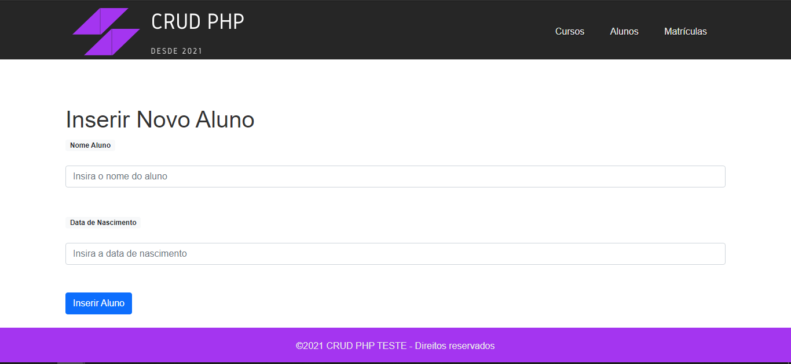

<h1 align="center">CRUD PHP</h1>

Projeto simples usando PHP e MySQL com o intuito de ajudar programadores iniciantes.

<h4 align="center"> Em construção...  🚧</h4>
	

<ul>
<li>Objetivo</li>
  
Cadastro de Alunos, Cursos e Notas

<li>Linguagem</li>
    
Php, MySQL, CSS, JavaScript e HTML

<li>Pré-requisitos</li>

Antes de começar, você vai precisar instalar e configurar um pacote AMP (*A*pache, *M*ySQL, *P*HP) 
Com o <a href="https://www.apachefriends.org/index.html">XAMPP</a> você já tem todas as ferramentas que precisa para rodar essa aplicação.
 
O arquivo SQL precisa ser importado no PhpMyadmin do localhost instalado na máquina ou basta executar o passo a passo do arquivo <b>indexBanco.php</b>
 
Extrair as pastas img, js e css localizadas no arquivo <b>Projeto.zip</b>
  
</ul>

### Funcionalidades do Projeto

- [x] Cadastro de Aluno
- [x] Cadastro de Curso
- [x] Matricular Aluno em um curso
- [x] Deletar Aluno
- [x] Deletar Curso
- [x] Remover Aluno de algum curso
- [x] Editar Aluno
- [x] Editar 

# Telas

!--Bottom session-->
 <h4 align=center>Made with by <a target="_blank" href="https://github.com/edfigueiredo" >Edson Figueiredo</a></h4>